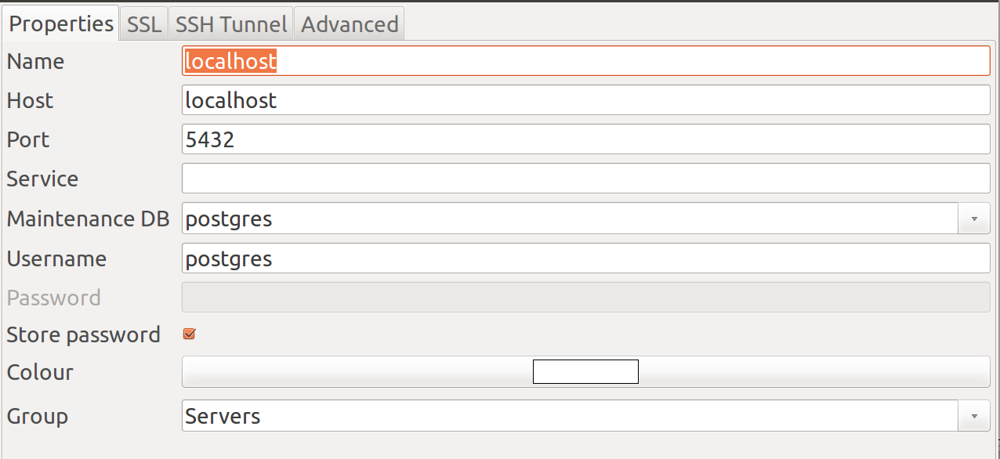

# Session 1 - Query plans & indexing

## Setup

Before you run the following command, make sure that another instance of PostgreSQL is not running and stop it of needed.

````
docker run -p 5432:5432 fiitpdt/postgres
````

If you get error like `Bind for 0.0.0.0:5432 failed: port is already allocated.` then there is another instance of PostgreSQL running and you need to stop it first.

This will initialize postgres and seed it with example data. It will take a while, but eventually, the output will stop with

````
LOG:  database system is ready to accept connections
LOG:  autovacuum launcher started
````

You can now connect to postgresql server running on localhost:5432 using your client of choice. For windows and linux we recommend [pgAdmin3](http://www.pgadmin.org/download/windows.php). Install the client on your local machine, docker is only running the server.

The database with example data is called `oz`, username is `postgres`, password is blank (there is no password). 

In pgAdmin, click on the plug icon in the toolbar to setup a new connection.


This is how the connection setup should look like in pgAdmin.



## Labs

Queries presented
- [`01_query_plan.sql`](01_query_plan.sql)
- [`02_indexes.sql`](02_indexes.sql)

## Homework

1. How big is the index (in megabytes)? Hint: The query is included in example sql files.
2. Create index on `supplier`. Imagine that you want to ignore case when searching, so you write query `select * from documents where lower(supplier) = lower('SPP');` (where `'SPP'` is user input that you have no control over). Why doesn't postgresql use the index? Try building a new index on lowercased column value `create index index_documents_on_lower_supplier on documents(lower(supplier));` and run the query again. Think about what happened and why postgresql can use the index now.

## Recommended reading

[Use the Index, Luke!](http://use-the-index-luke.com/) (free)
